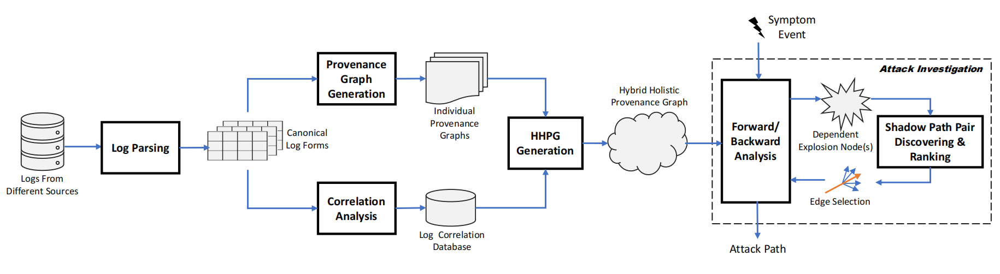

# HHPG

## Current Work Flow

## How to Use

### Parser folder usage:

- parse the raw logs from different sources into canonical forms.

### GraphBuilder folder usage:

- use CLF results to generate separate provenance graphs.

### CLG folder usage:

- use CLF results to generate correlated log graphs.

### CLF folder:

- the CLF results corresponding to different experiments.

### Graph folder:

- the generated separate provenance graph results corresponding to different experiments.

### HHPG.go usage:

- merge separate provenance graphs to holistic hybrid provenance graph.